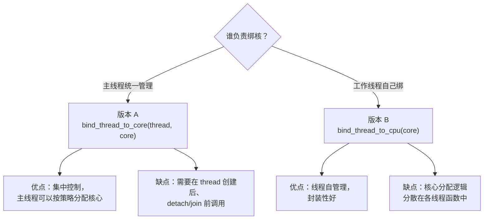

# 两个 CPU 绑定函数的对比分析

---

## 源码对比

### 版本 A：当前代码（绑定外部线程）

```cpp
void bind_thread_to_core(std::thread& thread, int core_id)
{
    cpu_set_t cpuset;
    CPU_ZERO(&cpuset);
    CPU_SET(core_id, &cpuset);

    int rc = pthread_setaffinity_np(thread.native_handle(), sizeof(cpu_set_t), &cpuset);
    if (rc != 0)
    {
        std::cerr << "Error calling pthread_setaffinity_np: " << std::strerror(rc) << std::endl;
    }
}
```

### 版本 B：新代码（自身绑定）

```cpp
bool bind_thread_to_cpu(int cpu_core) 
{
    int cpu_count = sysconf(_SC_NPROCESSORS_ONLN);
    if (cpu_core < 0 || cpu_core >= cpu_count) {
        std::cerr << "[错误] CPU核心" << cpu_core << "非法，当前CPU核心数：" << cpu_count << std::endl;
        return false;
    }

    cpu_set_t cpuset;
    CPU_ZERO(&cpuset);
    CPU_SET(cpu_core, &cpuset);
    pthread_t tid = pthread_self();
    int ret = pthread_setaffinity_np(tid, sizeof(cpu_set_t), &cpuset);
    if (ret != 0) {
        std::cerr << "[错误] 绑定CPU核心失败：" << std::strerror(ret) << std::endl;
        return false;
    }

    std::cout << "[成功] CPU密集线程已绑定到核心：" << cpu_core << std::endl;
    return true;
}
```

---

## 六大差异

### 1. 绑定目标：外部线程 vs 自身

| | 版本 A | 版本 B |
|--|--------|--------|
| 参数 | `std::thread& thread, int core_id` | `int cpu_core` |
| 获取线程 ID | `thread.native_handle()` | `pthread_self()` |
| 绑定的是 | **别的线程** | **调用者自己** |
| 调用方式 | 在主线程中调用，传入已创建的子线程 | 在工作线程函数内部调用 |

```cpp
// 版本 A 的用法：外部控制
std::thread t(worker_func);
bind_thread_to_core(t, 2);   // 主线程把 t 绑到核心 2
t.join();

// 版本 B 的用法：内部自己绑定
void worker_func() {
    bind_thread_to_cpu(2);    // 线程自己把自己绑到核心 2
    // ... 干活 ...
}
std::thread t(worker_func);
t.join();
```

### 2. `pthread_self()` vs `native_handle()`

```cpp
// 获取"自己"的 pthread ID
pthread_t tid = pthread_self();

// 获取"别人"（std::thread 封装的）的 pthread ID
pthread_t tid = thread.native_handle();
```

| 函数 | 头文件 | 返回值 | 含义 |
|------|--------|--------|------|
| `pthread_self()` | `<pthread.h>` | `pthread_t` | **调用线程**自身的 POSIX 线程 ID |
| `native_handle()` | `<thread>` | `native_handle_type` | 取出 `std::thread` 对象底层封装的**原生线程句柄** |

`native_handle()` 是 C++11 提供的"逃生舱"——当你需要用 POSIX API 操作 `std::thread` 时，用它取出原生句柄。在 Linux 上返回值就是 `pthread_t`。

### 3. 返回值：`void` vs `bool`

| | 版本 A | 版本 B |
|--|--------|--------|
| 返回值 | `void` | `bool` |
| 失败时 | 只打印错误，调用者无法感知 | 返回 `false`，调用者可据此处理 |

```cpp
// 版本 B 的好处：
if (!bind_thread_to_cpu(core)) {
    // 调用者知道失败了，可以降级处理或退出
    return;
}
```

### 4. 参数校验：无 vs 有

版本 B 多了核心号合法性检查：

```cpp
int cpu_count = sysconf(_SC_NPROCESSORS_ONLN);
if (cpu_core < 0 || cpu_core >= cpu_count) {
    // 拒绝非法核心号
    return false;
}
```

| 函数 | 作用 |
|------|------|
| `sysconf(_SC_NPROCESSORS_ONLN)` | 查询当前系统**在线**CPU 核心数 |

`_SC_NPROCESSORS_ONLN` 返回的是**当前可用的**核心数（在线数），区别于：
- `_SC_NPROCESSORS_CONF`：硬件配置的最大核心数（含可能被禁用的）

如果系统是 8 核，核心号只能是 0~7，传 8 或 -1 会被提前拦截。

### 5. 日志格式

| | 版本 A | 版本 B |
|--|--------|--------|
| 错误前缀 | `"Error calling..."` | `"[错误] ..."` |
| 成功日志 | 无 | `"[成功] ..."` |
| 结构化 | 否 | 是（`[错误]`/`[成功]` 统一前缀，便于 grep/日志分析） |

### 6. 无校验：`pthread_self()` 实际不需要校验

```cpp
// 版本 A
int rc = pthread_setaffinity_np(thread.native_handle(), ...);

// 版本 B  
pthread_t tid = pthread_self();     // 自己取，不会失败
int ret = pthread_setaffinity_np(tid, ...);
```

`pthread_self()` **总是成功**，不需要错误检查。而 `native_handle()` 理论上在 thread 未关联原生线程时可能有问题（虽然实践中 `std::thread` 构造后就一定有）。

---

## 核心 API：`pthread_setaffinity_np`

```c
int pthread_setaffinity_np(
    pthread_t thread,           // 目标线程
    size_t cpusetsize,          // cpu_set_t 的大小
    const cpu_set_t *cpuset     // 绑定的 CPU 集合
);
```

| 参数 | 说明 |
|------|------|
| `thread` | 要绑定的线程的 POSIX ID |
| `cpusetsize` | `sizeof(cpu_set_t)`，用于 ABI 兼容 |
| `cpuset` | 一个位掩码，每一位代表一个 CPU 核心 |
| 返回值 | 0 = 成功，非 0 = 错误码 |

### `cpu_set_t` 及相关宏

```cpp
cpu_set_t cpuset;           // 一个位掩码结构体
CPU_ZERO(&cpuset);          // 全部清零（不绑定任何核心）
CPU_SET(core_id, &cpuset);  // 将第 core_id 位置 1（绑定该核心）
```

本质上是位操作：

```
CPU_ZERO:  00000000  (0x00)
CPU_SET(2): 00000100  (0x04)   ← 核心 2 被标记
CPU_SET(0): 00000101  (0x05)   ← 核心 0 和 2，允许在这两个核上调度
```

### `_np` 后缀的含义

`pthread_setaffinity_np` 中的 `_np` = **Non-Portable**（不可移植）。这是 Linux 特有的扩展，不在 POSIX 标准中。在其他 OS 上需要用各自的 API（如 macOS 的 `thread_policy_set`）。

---

## 设计场景决定选哪个



在 ThreadPool 场景中，**版本 B 更适合**——在构造函数的工作线程 lambda 里直接调用，天然内聚：

```cpp
workers_lists_.emplace_back([this, i] {
    bind_thread_to_cpu(i);  // 第 i 个线程绑到核心 i
    while (true) { /* ... */ }
});
```

---

## 总结

| 维度 | 版本 A | 版本 B |
|------|--------|--------|
| 绑定对象 | 外部传入的线程 | 调用者自身 |
| 线程 ID 来源 | `native_handle()` | `pthread_self()` |
| 参数校验 | 无 | 校验核心号范围 |
| 返回值 | `void` | `bool` |
| 成功日志 | 无 | 有 |
| 错误可恢复 | 否 | 是 |
| 工程成熟度 | 原型级 | 生产级 |
