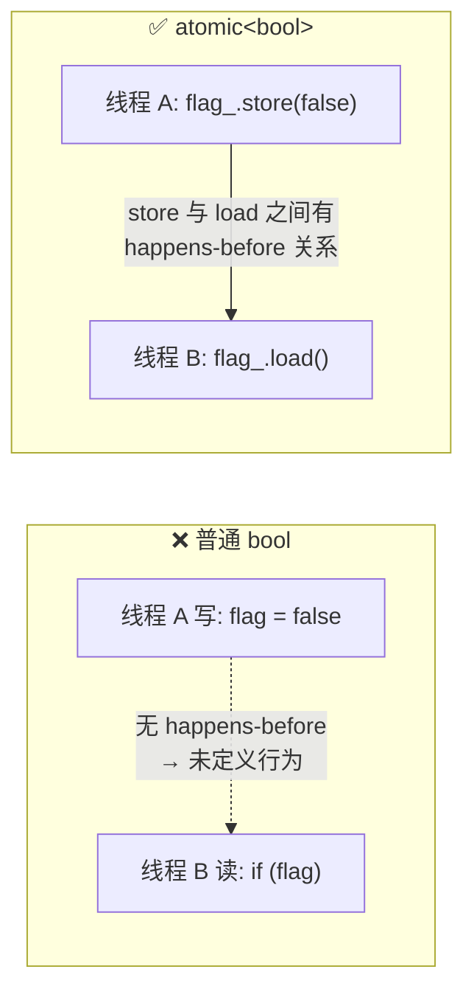

# Running_Flag 线程运行标志类设计总结

## 源码

```cpp
// 线程运行标志类
class Running_Flag
{
public:
    Running_Flag() : flag_(true) {}
    void stop() { flag_.store(false); }
    bool is_running() const { return flag_.load(); }
private:
    std::atomic<bool> flag_;
};
```

---

## 设计意图

这是一个极简的**跨线程运行状态标志**，只做一件事：让任意线程安全地查询"是否还在运行"、或设置"停止运行"。

典型使用场景：

```cpp
Running_Flag rf;

// 线程 A：干活，定期检查是否被叫停
std::thread worker([&rf] {
    while (rf.is_running()) {
        // 执行工作...
    }
});

// 线程 B：某时刻叫停
rf.stop();
worker.join();
```

---

## 设计要点

### 1. 为什么用 `std::atomic<bool>` 而不是普通 `bool`？



| 对比 | 普通 `bool` | `std::atomic<bool>` |
|------|-----------|-------------------|
| 多线程读写 | **UB（未定义行为）** | 安全，标准保证 |
| 是否需要加锁 | 必须用 mutex 保护 | 不需要，无锁 |
| 内存可见性 | 不保证（可能读到寄存器缓存值） | 保证（store 后 load 必可见） |
| 性能 | — | 接近普通变量读写（x86 上几乎零开销） |

### 2. 默认构造为 `true`

```cpp
Running_Flag() : flag_(true) {}
```

表示"一创建就在运行"，符合直觉——标志位不需要显式 `start()`，天生就是运行态。对外只需关心"何时停"。

### 3. 接口极简：只有两个操作

| 方法 | 底层操作 | 语义 | 调用者 |
|------|---------|------|--------|
| `stop()` | `flag_.store(false)` | 原子写，发出停止信号 | 控制线程 |
| `is_running()` | `flag_.load()` | 原子读，查询是否还在运行 | 工作线程 |

没有 `start()`、没有 `reset()`、没有 `toggle()`——**只做必要的事**。

### 4. `const` 正确性

```cpp
bool is_running() const { return flag_.load(); }
```

`is_running()` 标记为 `const`，因为 `atomic::load()` 在逻辑上是只读操作（不改变标志位的语义状态）。这让它可以在 `const Running_Flag&` 上下文中使用。

---

## 底层原理：`std::atomic<bool>` 的内存序

`store()` 和 `load()` 默认使用 `memory_order_seq_cst`（最强的顺序一致性）：

```
        Thread A                    Thread B
    ───────────────             ───────────────
    flag_.store(false);         
                                   flag_.load();  // 保证读到 false
```

**顺序一致性保证**：所有线程观察到的所有原子变量的修改顺序都是一致的。就像一个全局的时间线，A 写在先，B 读在后，B 一定能看到 A 的写入。

如果需要更高性能且语义允许，可以放宽为 `memory_order_release` / `memory_order_acquire`：

```cpp
void stop()        { flag_.store(false, std::memory_order_release); }
bool is_running()  { return flag_.load(std::memory_order_acquire); }
```

释放-获取对（release-acquire pair）同样保证可见性，但开销更低。

---

## 与 ThreadPool 中 `stop_` 的对比

| | `Running_Flag` | ThreadPool 的 `stop_` |
|--|---------------|----------------------|
| 类型 | `std::atomic<bool>` | 普通 `bool` |
| 保护机制 | 自身原子操作 | `queue_mutex_` 加锁保护 |
| 通知机制 | 无（调用者轮询 `is_running()`） | `condition_.notify_all()` 主动推送 |
| 适用场景 | 外部随时查询运行状态 | 线程池内部退出控制 + 唤醒休眠线程 |
| 是否需要配合条件变量 | 否 | 是（配合 `condition_` 唤醒 `wait` 中的线程） |

**核心差异**：`stop_` 不仅要设置标志，还要配合 `condition_variable` 做**通知唤醒**——这是锁 + 条件变量的组合拳。`Running_Flag` 只需要一个独立、无锁、随时可查的标志位，用 `atomic` 是最合适的。

---

## 设计哲学

```
一个类只做一件事，把它做好。

Running_Flag 不关心：
  ✗ 谁在等这个标志
  ✗ 需要通知谁
  ✗ 标志之外还有什么状态

Running_Flag 只关心：
  ✓ 安全地读写一个布尔标志
```
