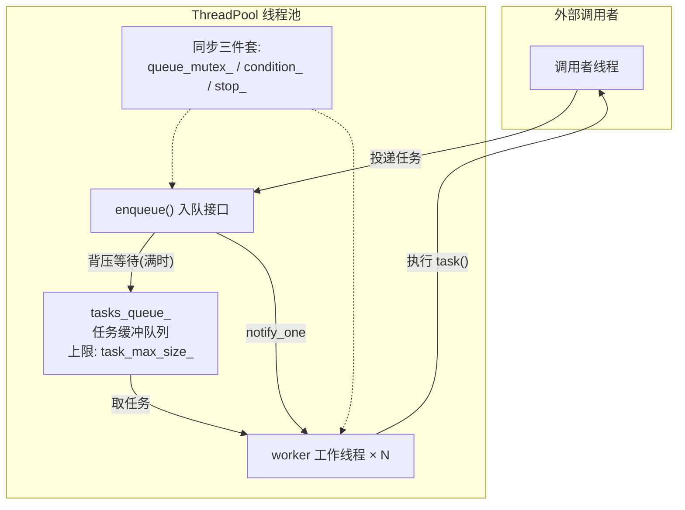
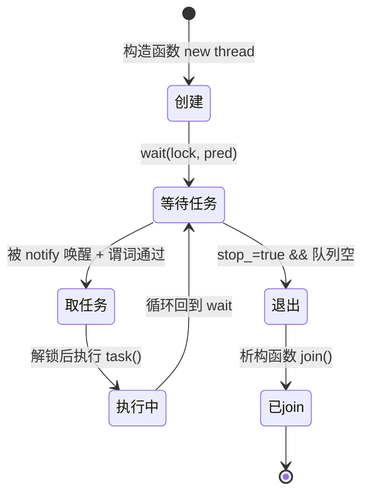

# 线程池 ThreadPool 设计总结

## 整体架构



---

## 核心组件一览

| 组件 | 类型 | 作用 |
|------|------|------|
| `workers_lists_` | `vector<thread>` | 线程容器，持有所有工作线程 |
| `tasks_queue_` | `queue<function<void()>>` | 任务缓冲队列，存储待执行的 `void()` 可调用对象 |
| `task_max_size_` | `size_t` | 队列容量上限，超过后生产者阻塞（背压） |
| `queue_mutex_` | `mutex` | 保护任务队列的互斥锁 |
| `condition_` | `condition_variable` | 两用的条件变量：消费者等"不空"，生产者等"不满" |
| `stop_` | `bool` | 析构信号，通知工作线程退出循环 |

---

## 设计模式：生产者-消费者

ThreadPool 是经典的**单生产者(可能多)、多消费者**模型：

| 角色 | 实体 | 操作 |
|------|------|------|
| 生产者 | 调用 `enqueue()` 的任意线程 | 将任务放入队列，`notify_one()` 唤醒消费者 |
| 消费者 | `workers_lists_` 中的工作线程 | 从队列取任务执行，队列空时 `wait` 休眠 |
| 缓冲区 | `tasks_queue_` | 有界队列，`task_max_size_` 限制容量 |

---

## 两处 `wait` 的对称设计

同一个 `condition_` 承载两类等待：

```
condition_ 等待队列
├── 🟢 消费者 × N   wait(lock, stop || !empty)      "等活干 或 等死"
└── 🔵 生产者 × 1   wait(lock, size < max_size)     "等空位"
```

| | 消费者 wait | 生产者 wait |
|--|-----------|-----------|
| **位置** | 构造函数，工作线程循环 | `enqueue()` |
| **谓词** | `stop_ \|\| !tasks_queue_.empty()` | `tasks_queue_.size() < task_max_size_` |
| **含义** | "要么让我退出，要么给我任务" | "队列没满才继续" |
| **唤醒者** | `enqueue` 末尾 `notify_one()` | 工作线程 `pop()` 后（⚠️ 当前缺失） |

> 详见 `任务队列满时enqueue阻塞机制.md` 和 `条件变量两处wait对比.md`

---

## 线程生命周期



关键代码段：

```cpp
// 构造函数中每个工作线程的主循环
while (true) {
    std::function<void()> task;
    {
        std::unique_lock<std::mutex> lock(this->queue_mutex_);
        // 💤 休眠直到：被叫停 或 队列有任务
        this->condition_.wait(lock, [this] {
            return this->stop_ || !this->tasks_queue_.empty();
        });
        // 🚪 退出条件
        if (this->stop_ && this->tasks_queue_.empty())
            return;
        // 📦 取任务（move 避免拷贝）
        task = std::move(this->tasks_queue_.front());
        this->tasks_queue_.pop();
    }   // 🔓 出作用域自动解锁，其他线程可以取任务
    task();  // 执行任务时不持有锁
}
```

---

## 线程安全设计

| 机制 | 保护对象 | 说明 |
|------|---------|------|
| `queue_mutex_` | `tasks_queue_`、`stop_` | 所有对队列和停止标志的读写都在锁内 |
| `condition_` + 谓词 | 线程同步 | 保证"释放锁→休眠→唤醒→重新加锁→检查谓词"的原子性 |
| `std::atomic<bool>` (Running_Flag) | 独立标志位 | 无锁线程安全读写 |
| 锁外执行 `task()` | 并发性 | 执行任务时不持有锁，其他线程可同时取任务 |

### 为什么 `task()` 在锁外执行？

```cpp
{   // 临界区：只做"取任务"这个轻量操作
    lock ...
    task = move(queue.front());
    queue.pop();
}   // 解锁
task();  // 重量操作在锁外，不阻塞其他线程取任务
```

如果 `task()` 在锁内执行，线程池退化为串行执行 — 违背了线程池的初衷。

---

## Running_Flag 类（辅助类）

```cpp
class Running_Flag
{
public:
    Running_Flag() : flag_(true) {}
    void stop()         { flag_.store(false); }          // 写：设置停止
    bool is_running()   const { return flag_.load(); }   // 读：查询状态
private:
    std::atomic<bool> flag_;
};
```

| 设计点 | 说明 |
|--------|------|
| `std::atomic<bool>` | 保证多线程读写无数据竞争，无需额外加锁 |
| `store(false)` | 原子写，对所有后续 `load()` 可见 |
| `load()` | 原子读，获取最新值 |
| `const` 正确性 | `is_running()` 标记 `const`，只读语义明确 |

> **与 `stop_` 的区别**：`stop_` 依赖 `queue_mutex_` 保护 + `condition_` 通知，用于线程池内部线程退出。`Running_Flag` 是独立的原子标志，供外部查询运行状态，无锁，更轻量。

---

## 设计要点总结

| 要点 | 实现 |
|------|------|
| **有界队列** | `task_max_size_` 限制容量，防止内存暴涨 |
| **背压** | 队列满时生产者 `wait`，自然降速 |
| **优雅退出** | `stop_` + `notify_all()` + `join()`，等所有线程执行完当前任务 |
| **锁粒度最小化** | 只在操作队列时加锁，`task()` 在锁外执行 |
| **移动语义** | `std::move(task)` 避免 `std::function` 拷贝开销 |
| **完美转发** | `enqueue` 用 `F&&` + `std::forward`，保持参数值类别 |
| **类型擦除** | 用 `std::function<void()>` 统一所有任务类型 |

---

## 当前已知问题

| 问题 | 描述 | 影响 |
|------|------|------|
| 工作线程 `pop()` 后无 `notify` | 生产者因队列满阻塞后，消费者取出任务腾出空间但没通知生产者 | 生产者永久阻塞（死锁） |
| 单条件变量承载两类等待 | `condition_` 同时用于"不空"和"不满"两类通知 | 需确保双方都有 `notify` |

修复方案：在工作线程 `pop()` 后加 `condition_.notify_one()`。
