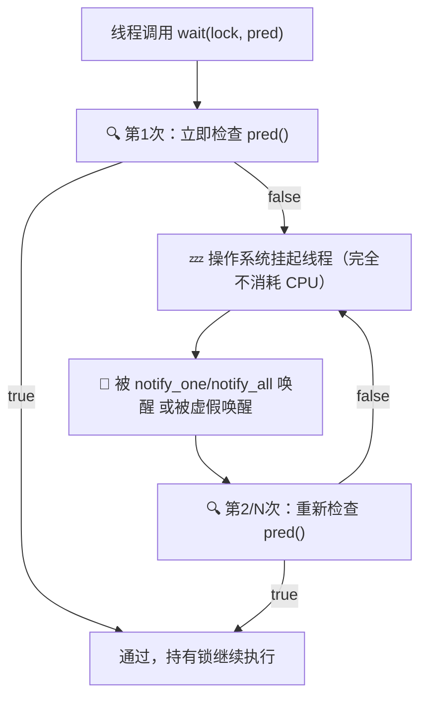

# `condition_variable::wait` 带谓词的原理与性能分析

## 核心结论：不是轮询，不消耗 CPU

`condition_variable::wait(lock, pred)` **不是**一直轮询判断谓词。线程休眠期间由操作系统挂起，零 CPU 占用。

---

## 等价展开

```cpp
// 带谓词的写法（推荐）：
this->condition.wait(lock, [this] {
    return this->stop || !this->tasks_queue.empty();
});

// 等价于手动写 while 循环：
while (!this->stop && this->tasks_queue.empty()) {
    this->condition.wait(lock);
}
```

C++ 标准保证带谓词的重载自动处理**虚假唤醒（spurious wakeup）**，无需手动写 `while`。

---

## 谓词在什么时候检查？

只在以下 3 个时刻检查，不是持续轮询：



**关键**：线程休眠期间（步骤 D）完全由操作系统接管，底层是 POSIX 的 `pthread_cond_wait`，线程被移出 CPU 调度队列。

---

## 谓词执行次数统计

| 场景 | 谓词执行次数 |
|------|------------|
| 入队一个任务 + `notify_one()` | 被唤醒的**那个线程**执行 **1 次** |
| 线程池析构，`stop=true` + `notify_all()` | 每个线程执行 **1 次**，发现 stop 为 true，退出循环 |
| 虚假唤醒（极罕见） | 多执行 1 次，发现队列仍空，继续休眠 |

谓词本身（两个布尔/判空）是 **O(1)** 操作，开销可忽略。

---

## 谁在通知（notify）？

通知方是生产者——即 `enqueue` 方法：

```cpp
template<class F, class... Args>
void enqueue(F&& f, Args&&... args)
{
    {
        std::unique_lock<std::mutex> lock(queue_mutex);
        tasks_queue.emplace(/* 封装好的任务 */);
    }
    condition.notify_one();  // 👈 唤醒一个休眠的线程
}
```

**主动通知，而非轮询。** 没有 `notify`，线程永远不会被唤醒。

---

## 为什么不会"消耗性能"？

| 常见误解 | 实际情况 |
|---------|---------|
| "一直在判断" | ❌ 只在被唤醒时判断，休眠期间零 CPU 占用 |
| "很消耗性能" | ❌ `condition_variable` 正是为了解决忙等（busy-wait）而设计的标准同步原语 |
| "需要手动轮询" | ❌ OS 级别的条件变量自动处理线程挂起/唤醒 |

---

## 适用场景：生产者-消费者模型

这就是线程池的本质：

- **生产者**：`enqueue` 入队后 `notify_one()`
- **消费者**：工作线程 `wait` 后被唤醒 → 检查谓词通过 → 取任务 → 执行
- **全程无忙等**，CPU 专注执行实际任务
