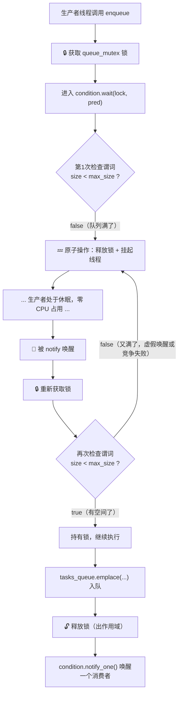

# 任务队列满时的底层执行逻辑

## 场景复现

```cpp
inline void ThreadPool::enqueue(F&& f, Args&&... args)
{
    auto task = std::bind(std::forward<F>(f), std::forward<Args>(args)...);
    {
        std::unique_lock<std::mutex> lock(queue_mutex);
        // 👇 如果队列满了，这里会发生什么？
        condition.wait(lock, [this] { return tasks_queue.size() < task_max_size; });
        tasks_queue.emplace(std::move(task));
    }
    condition.notify_one();
}
```

假设 `task_max_size = 5`，当前队列已有 5 个未处理任务。

---

## 逐步分解



---

## 关键步骤详解

### 步骤 4：`wait` 内部的原子操作

这是最关键的一步。`condition_variable::wait` 在发现谓词为 false 后，会执行一个**不可分割的原子操作**：

```
原子地：释放 lock + 将当前线程加入等待队列 + 挂起线程
```

为什么要原子？考虑如果分开执行会怎样：

| 时序 | 如果先释放锁再挂起 | 后果 |
|------|-------------------|------|
| T1 | 生产者释放锁 | — |
| T2 | 消费者 pop 了一个任务，`notify_one()` | 通知发给了空气，因为生产者还没加入等待队列 |
| T3 | 生产者加入等待队列并挂起 | **永远等不到通知 → 死锁** |

原子操作保证了：**在你释放锁的那一瞬间，你已经注册为等待者了。** 任何在这之后获取锁的线程发出的 `notify` 都能唤醒你。

### 步骤 7：被谁唤醒？

当前设计中，**`enqueue` 和被唤醒的生产者共用同一个条件变量 `condition`**：

| 等待方 | 等待条件 | 唤醒方 |
|--------|---------|--------|
| 工作线程 | `stop \|\| !tasks_queue.empty()` | `enqueue` 末尾的 `notify_one()` |
| 生产者（队列满时） | `tasks_queue.size() < task_max_size` | ❓ |

---

## ⚠️ 潜在问题：生产者可能永远不会被唤醒

观察工作线程的循环：

```cpp
// 工作线程中
this->condition.wait(lock, [this] {
    return this->stop || !this->tasks_queue.empty();
});
task = std::move(this->tasks_queue.front());
this->tasks_queue.pop();   // 👈 pop 后队列有空位了，但没有 notify！
// ... 出锁执行 task() ...
```

**工作线程 pop 任务后没有调用 `condition.notify_one()`**。这意味着：

1. 生产者因为队列满而休眠
2. 工作线程取出一个任务，队列有空位了
3. 但没有任何人通知生产者
4. 生产者继续休眠 → **相当于死锁**

---

## 时序图：死锁场景

```
时间 →

生产者线程                    工作线程1              工作线程2
    |                            |                      |
    | enqueue()                  | wait(空队列)          | wait(空队列)
    | lock ✓                     |                      |
    | 队列满! wait释放锁,休眠    |                      |
    |                            | 被notify唤醒          |
    |                            | pop任务,队列-1        |
    |                            | 执行task...           | ← 队列有空位了
    | 💤 还在睡...              | 循环回来,wait(空队列)  | 💤
    | 💤 还在睡...              | 💤                    | 💤
    | 💤 永远等下去...          | 💤                    | 💤
```

---

## 修复方案

### 方案 A：工作线程 pop 后通知（最简单）

```cpp
task = std::move(this->tasks_queue.front());
this->tasks_queue.pop();
// 通知可能正在等待队列空间的生产者
condition.notify_one();  // 👈 加上这一行
```

### 方案 B：使用两个条件变量（更清晰）

```cpp
std::condition_variable condition_not_empty;  // 消费者等
std::condition_variable condition_not_full;   // 生产者等
```

各自等待各自的条件，各自通知各自的对象，语义更明确。

> 注意：方案 B 中，`enqueue` 和 `notify_all` 在析构时需要对两个条件变量都做通知。

---

## 总结

| 阶段 | 操作 | CPU 占用 |
|------|------|---------|
| 检查谓词 | 判断 `size < max_size` | O(1)，瞬时 |
| 等待休眠 | `pthread_cond_wait` 挂起 | **零** |
| 被唤醒 | 重新获取锁 + 检查谓词 | O(1)，瞬时 |
| 入队执行 | `emplace` + `notify_one` | 正常开销 |

核心机制依旧是**条件变量 + 谓词**，和你之前学的 `condition_variable::wait` 原理完全一致——只不过这次等待的条件从"队列不空"变成了"队列不满"，是一个**背压（backpressure）**机制，防止生产者无限投递任务撑爆内存。
