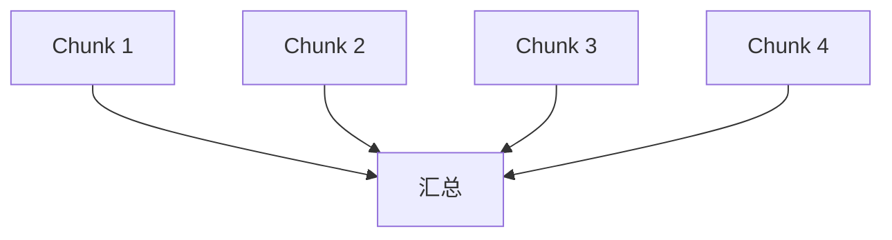
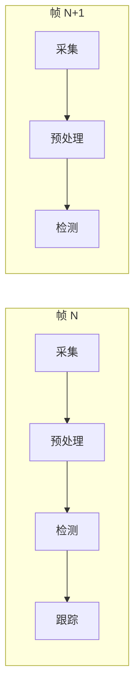
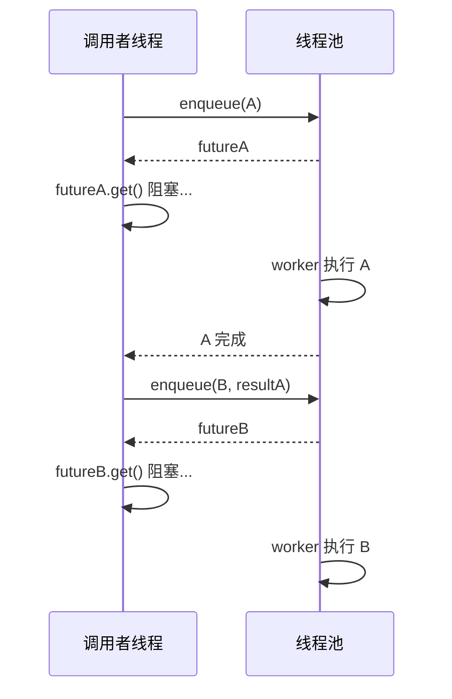
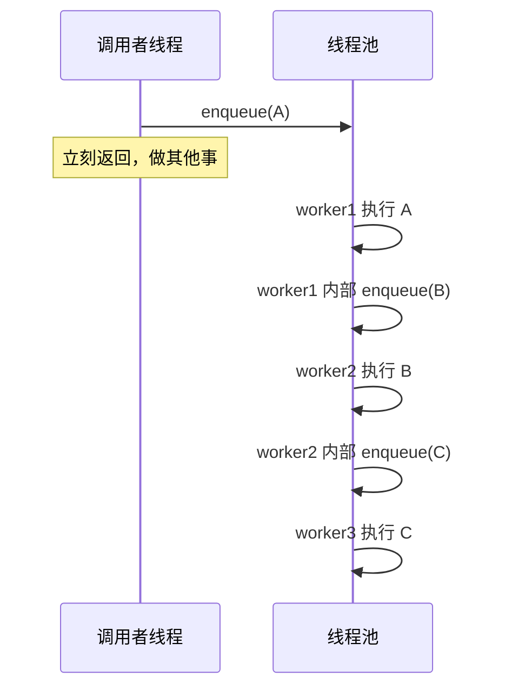
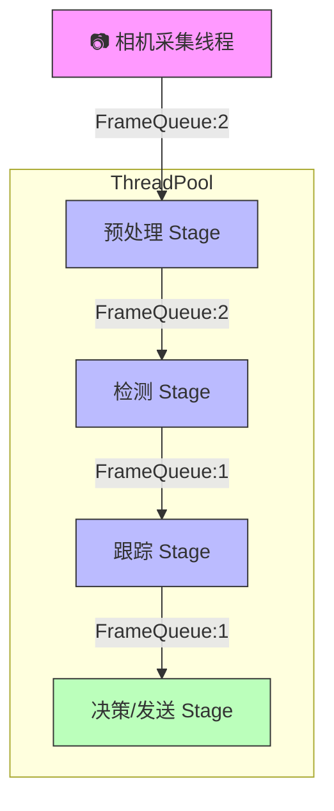

# 线程池异步依赖问题详解：串行 vs 并发，帧间 vs 帧内

## 目录

1. [问题重述](#1-问题重述)
2. [串行的根源：数据依赖](#2-串行的根源数据依赖)
3. [「退化」的真相：一条链 vs 整个系统](#3-退化的真相一条链-vs-整个系统)
4. [流水线模型：帧级并行的核心](#4-流水线模型帧级并行的核心)
5. [四种异步模式对比](#5-四种异步模式对比)
6. [相机处理管线的实际设计](#6-相机处理管线的实际设计)
7. [常见误区](#7-常见误区)
8. [总结](#8-总结)

---

## 1. 问题重述

> 如果一个线程池处理的函数有返回值，这个返回值还需要给到其他线程中的函数处理，那这不又退化成串行吗？如何做到异步？还是说彼此的处理都不是同一帧上的，导致逻辑等问题？

这个问题的本质是：**当任务之间存在数据依赖时，异步和并发的边界在哪里？**

---

## 2. 串行的根源：数据依赖

### 2.1 什么情况下「必然串行」

```cpp
// Task A 产出 data，Task B 消费 data
int data = taskA();   // 必须等 A 完成
taskB(data);          // 才能执行 B
```


**这不是线程池的问题，是数据依赖决定的。** 就像你不能在不知道 `x` 的值之前计算 `x + 1`。

### 2.2 关键区分：什么可以并发

```cpp
// ✅ 完全并发：每个 chunk 独立
for (int i = 0; i < 100; i++)
    pool.enqueue(process_chunk, i);   // 100 个任务互不依赖

// ❌ 必然串行：B 依赖 A 的输出
auto fa = pool.enqueue(taskA);
auto fb = pool.enqueue(taskB, fa.get());  // fa.get() 阻塞

// ✅ 部分并发：A1,A2,A3 并发，B 依赖全部
auto f1 = pool.enqueue(taskA, data1);  // ─┐
auto f2 = pool.enqueue(taskA, data2);  //  ├ 这三行并发
auto f3 = pool.enqueue(taskA, data3);  // ─┘
auto fb = pool.enqueue(taskB, f1.get(), f2.get(), f3.get());  // B 等待全部 A
```

**法则：依赖图 (DAG) 中的每条边 = 一次串行等待，没有边的节点 = 可并发。**



> A1~A4 之间无边 → 完全并行。B 有 4 条入边 → B 必须等全部 A 完成。

---

## 3. 「退化」的真相：一条链 vs 整个系统

### 3.1 单链视角（悲观）

如果只盯一条依赖链：

```
A1 → B1 → C1 → D1
```

确实，A1→B1→C1→D1 每一步都在等上一步，看起来「退化成了串行」。

### 3.2 系统视角（真实）

但线程池里同时在跑的不止这一条链：

```
时间 →

线程1:  [A1████] [B1██████] [C1███] [D1████]
线程2:  [A2████] [B2██████] [C2███] [D2████]
线程3:  [A3████] [B3██████] [C3███] [D3████]
线程4:  [A4████] [B4██████] [C4███] [D4████]

纵轴：每条链内部串行
横轴：多条链之间并发
```

| 视角 | 看到的 | 结论 |
|------|--------|------|
| 单条链 | A→B→C→D 串行 | 「退化了」 |
| 系统整体 | 4 条链同时推进 | 4 倍吞吐量 |

**你的困惑正是把「一条链的串行」误等同于「整个系统的串行」。**

---

## 4. 流水线模型：帧级并行的核心

### 4.1 相机处理的典型流水线

在 RC2026 相机项目中，一帧图像经过多个处理阶段：

```
一帧的处理链路：
  采集(Raw) → 预处理(颜色/去噪) → 检测(装甲板) → 跟踪(Kalman) → 决策(发送)
```

### 4.2 串行执行（最慢）

```
帧0:  [采集|预处理|检测|跟踪|决策]  耗时 = Σ 所有阶段
帧1:                                [采集|预处理|检测|跟踪|决策]
帧2:                                                       [采集|预...]

吞吐量 = 1 / Σ(阶段耗时)
```

所有阶段串行 → 一帧的延迟 = 所有阶段之和，帧率极低。

### 4.3 流水线执行（标准做法）

```
时间 →

       t0    t1    t2    t3    t4    t5    t6
帧0:  [采集][预处理][检测][跟踪][决策]
帧1:        [采集][预处理][检测][跟踪][决策]
帧2:              [采集][预处理][检测][跟踪][决策]
帧3:                    [采集][预处理][检测][跟踪][决策]
帧4:                          [采集][预处理][检测][跟踪][决策]
```



- **同一帧内**：采集→预处理→检测→跟踪 是串行的（数据依赖）
- **不同帧之间**：帧 N 的预处理 和 帧 N+1 的采集 同时进行
- **吞吐量**：= 1 / max(各阶段耗时)，而非 1 / Σ(各阶段耗时)

**延迟 vs 吞吐量的分离**：

| 指标 | 值 |
|------|---|
| 单帧延迟 | Σ(所有阶段) —— 流水线不减少延迟 |
| 系统吞吐 | 1 / max(各阶段) —— 流水线大幅提升吞吐 |

### 4.4 代码示意

```cpp
#include <queue>
#include <mutex>
#include <condition_variable>

// 帧队列：连接流水线的相邻阶段
template<typename T>
class FrameQueue {
    std::queue<T> q_;
    std::mutex mtx_;
    std::condition_variable cv_;
    size_t max_size_;
public:
    FrameQueue(size_t max_size = 2) : max_size_(max_size) {}

    void push(T frame) {
        std::unique_lock<std::mutex> lock(mtx_);
        cv_.wait(lock, [this] { return q_.size() < max_size_; });
        q_.push(std::move(frame));
        cv_.notify_one();
    }

    T pop() {
        std::unique_lock<std::mutex> lock(mtx_);
        cv_.wait(lock, [this] { return !q_.empty(); });
        T frame = std::move(q_.front());
        q_.pop();
        cv_.notify_one();
        return frame;
    }
};

// 流水线阶段：在 ThreadPool 中运行
class PipelineStage {
    FrameQueue<Frame>& in_queue_;
    FrameQueue<Frame>& out_queue_;
    ThreadPool& pool_;
    std::atomic<bool> running_{true};

public:
    PipelineStage(FrameQueue<Frame>& in, FrameQueue<Frame>& out, ThreadPool& pool)
        : in_queue_(in), out_queue_(out), pool_(pool) {}

    // 启动：往线程池提交一个永久循环
    void start() {
        pool_.enqueue([this]() {
            while (running_) {
                // 1. 等待上一阶段产出
                Frame f = in_queue_.pop();

                // 2. 本阶段处理（耗时操作）
                Frame processed = process(f);

                // 3. 交给下一阶段
                out_queue_.push(std::move(processed));
            }
        });
    }

    void stop() { running_ = false; }

    Frame process(const Frame& f) {
        // 具体处理逻辑：预处理/检测/跟踪...
        return f;
    }
};

// 组装完整流水线
int main() {
    ThreadPool pool(8, 100);

    FrameQueue<Frame> raw_to_pre(2);     // 采集 → 预处理
    FrameQueue<Frame> pre_to_detect(2);  // 预处理 → 检测
    FrameQueue<Frame> detect_to_track(2); // 检测 → 跟踪

    PipelineStage preprocess(raw_to_pre, pre_to_detect, pool);
    PipelineStage detect(pre_to_detect, detect_to_track, pool);
    PipelineStage track(detect_to_track, /*最终输出*/..., pool);

    preprocess.start();
    detect.start();
    track.start();

    // 采集线程不断往 raw_to_pre 推帧
    while (true) {
        Frame raw = camera.capture();
        raw_to_pre.push(raw);
    }
}
```

**关键洞察**：

- `FrameQueue` 的容量设为 2（双缓冲），避免无限制积压
- 每个 Stage 是一个长期运行的任务，自己循环取帧→处理→推帧
- **没有** 在调用者线程里 `future.get()` 阻塞——worker 线程自己推动流水线

---

## 5. 四种异步模式对比

| 模式 | 依赖处理方式 | 调用者是否阻塞 | 适用场景 |
|------|-------------|:---:|------|
| **同步等待** | `future.get()` 在调用者 | ✅ 阻塞 | 简单脚本、一次性任务 |
| **回调链** | A 完成后在线程池里提交 B | ❌ 不阻塞 | 有依赖的多步任务 |
| **流水线** | FrameQueue 连接各 Stage | ❌ 不阻塞 | 流式处理、相机管线 |
| **Map-Reduce** | 批量并发 → 汇总 | ⚠️ 仅在汇总时阻塞 | 数据并行计算 |

### 5.1 同步等待（最朴素，确实有退化感）

```cpp
// 调用者线程被卡住
auto fa = pool.enqueue(stepA, data);
auto fb = pool.enqueue(stepB, fa.get());   // ← 调用者卡在这里
auto fc = pool.enqueue(stepC, fb.get());   // ← 又卡
```



- 优点：逻辑清晰、易理解
- 缺点：调用者线程被反复阻塞，无法做其他事
- 适用：调用者本来就没事做、或者任务量很小

### 5.2 回调链（Continuation，推荐用于有依赖的多步任务）

```cpp
void submit_pipeline(ThreadPool& pool, Data data)
{
    pool.enqueue([&pool, data]() {
        // Step 1: 在线程池内执行
        auto r1 = stepA(data);

        // Step 2: 提交下一步（注意这里不阻塞调用者！）
        pool.enqueue([&pool, r1 = std::move(r1)]() {
            auto r2 = stepB(r1);

            pool.enqueue([r2 = std::move(r2)]() {
                stepC(r2);  // 最终步
            });
        });
    });
    // 调用者立刻返回！不阻塞！
}
```



- 优点：调用者线程零阻塞
- 缺点：嵌套深时可读性下降（可用 `.then()` 风格的 future 改善，见下文）
- 适用：有明确先后依赖的任务链

**C++ 中没有 `.then()` 怎么办？**

可以用一个简单的链式封装：

```cpp
template<typename T>
class TaskChain {
    std::future<T> fut_;
public:
    explicit TaskChain(std::future<T> f) : fut_(std::move(f)) {}

    template<typename F>
    auto then(ThreadPool& pool, F&& f) {
        // 返回新的 TaskChain，链接下一步
        using NextReturn = std::invoke_result_t<F, T>;
        auto nextFut = pool.enqueue([fut = std::move(fut_), f = std::forward<F>(f)]() mutable {
            return f(fut.get());
        });
        return TaskChain<NextReturn>(std::move(nextFut));
    }

    T get() { return fut_.get(); }
};

// 使用：链式调用，清晰可读
auto result = TaskChain(pool.enqueue(stepA, data))
    .then(pool, stepB)
    .then(pool, stepC)
    .then(pool, [](auto x) { return finalize(x); })
    .get();
```

### 5.3 流水线（Pipeline，相机项目的最佳选择）

见第 4 节详细说明。核心思想：

- 不是把「A 完成→提交 B」写成两个 enqueue
- 而是每个阶段是一个**永久循环的 worker**，通过队列与相邻阶段通信

```cpp
// 阶段就是一个无限循环
void stage_loop(FrameQueue<Frame>& in, FrameQueue<Frame>& out) {
    while (running) {
        Frame f = in.pop();    // 阻塞等待输入
        out.push(process(f));  // 处理后输出
    }
}
```

**流水线 vs 回调链的区别**：

| | 回调链 | 流水线 |
|---|---|---|
| 任务粒度 | 每个步骤一个任务 | 每个阶段一个永久循环 |
| 依赖传递 | 嵌套 enqueue | 通过 FrameQueue |
| 背压 | 依赖队列满阻塞 | FrameQueue 容量控制 |
| 适用 | 一次性/偶发任务 | 持续流式处理 |

### 5.4 Map-Reduce（数据并行）

```cpp
// Map 阶段：全并行
std::vector<std::future<int>> partials;
for (auto& chunk : chunks) {
    partials.push_back(pool.enqueue(process, chunk));
}

// Reduce 阶段：这步串行，但极快
int total = 0;
for (auto& f : partials)
    total += f.get();    // 只是求和，不是计算
```

并发度分析：

```
假设 1000 个 chunk，每个处理 10ms，线程池 8 线程：

纯串行：1000 × 10ms = 10000ms
Map-Reduce：1000/8 × 10ms + 1000 × 0.001ms(汇总) ≈ 1251ms
加速比：约 8x
```

---

## 6. 相机处理管线的实际设计

### 6.1 为什么流水线比「enqueue 回调链」更适合相机

| 考量 | 回调链 | 流水线 |
|------|--------|--------|
| 帧率稳定性 | 每次 enqueue 有开销 | 队列 push/pop 极轻量 |
| 背压控制 | 依赖线程池队列满 | FrameQueue 独立控制，可设容量 |
| 调试 | 嵌套追踪困难 | 每个阶段是独立函数/类 |
| 丢帧策略 | 难实现 | FrameQueue 容量=1 即自动丢旧帧 |
| 延迟测量 | 难追踪单帧路径 | 每帧可带时间戳，轻松测延迟 |

### 6.2 带时间戳的帧结构

```cpp
struct Frame {
    cv::Mat image;
    std::chrono::steady_clock::time_point timestamp;
    int frame_id;

    // 可附加各阶段的延迟测量
    std::chrono::steady_clock::time_point stage_enter_time;
};

// 每个阶段记录延迟
Frame process_stage(Frame f) {
    auto t1 = std::chrono::steady_clock::now();
    // ... 处理 ...
    auto t2 = std::chrono::steady_clock::now();
    log_latency("stage_name", f.frame_id, t2 - t1);
    return f;
}
```

### 6.3 丢帧策略

```cpp
template<typename T>
class DropOldFrameQueue {
    std::queue<T> q_;
    std::mutex mtx_;
    std::condition_variable cv_;
    size_t max_size_;

public:
    explicit DropOldFrameQueue(size_t max_size = 1) : max_size_(max_size) {}

    void push(T frame) {
        std::unique_lock<std::mutex> lock(mtx_);
        if (q_.size() >= max_size_) {
            q_.pop();  // 丢掉最旧的帧
            log_dropped_frame();
        }
        q_.push(std::move(frame));
        cv_.notify_one();
    }

    // pop 同前...
};
```

当某阶段处理变慢时，下游会丢弃堆积的旧帧，始终处理最新帧——这在实时相机系统中至关重要。

### 6.4 完整架构图



- 绿色节点是最终输出
- 蓝色节点在 ThreadPool 中并发运行
- FrameQueue 容量标注决定了积压和丢帧行为

---

## 7. 常见误区

### 误区 1：「有 future 就是串行」

**错。** `future` 只是异步结果的信箱。你**可以选择**何时去取：

```cpp
// 提交后立刻做别的事
auto f1 = pool.enqueue(taskA);
auto f2 = pool.enqueue(taskB);
do_something_else();     // ← 不阻塞
int a = f1.get();        // 真正需要时才等

// vs 立即等（这才是你担心的退化）
auto f1 = pool.enqueue(taskA);
int a = f1.get();        // 立刻等 → 退化
```

**退化不是因为 future，是因为你选择立刻 wait。**

### 误区 2：「返回值交给其他线程就必须在当前线程等」

**错。** 可以让 worker 线程自己提交后继（见 5.2 回调链）。

### 误区 3：「流水线 = 多线程串行，没加速」

**错。** 流水线加速的是系统吞吐量，不是单帧延迟。

```
单帧延迟：仍 = Σ 所有阶段（甚至略增，因为有队列开销）
系统吞吐：从 1/Σ 提升到 1/max(单阶段)
```

如果你的目标是**降低单帧延迟**，流水线帮不了你——需要优化各阶段本身的算法。

如果你的目标是**提高帧率**（吞吐），流水线是最佳方案。

### 误区 4：「所有任务都应该异步」

**错。** 异步有开销（上下文切换、队列操作、future 管理）。如果任务本身极短（微秒级），异步的开销可能超过任务本身。

```
任务耗时 < 10μs  → 同步执行
任务耗时 10μs~1ms → 视情况而定
任务耗时 > 1ms   → 值得异步
```

---

## 8. 总结

### 你问题的答案

| 你的问题 | 回答 |
|----------|------|
| 「有返回值交给其他线程，是否退化串行？」 | **单条依赖链内部是串行的，但系统整体是并发的。** 数据依赖不可消除，但可以组织成多条并发链 |
| 「如何做到异步？」 | 不要让调用者在自己的线程里 `future.get()`，让 worker 线程自己在池里提交后继（回调链），或用 FrameQueue 做流水线 |
| 「是不是不同帧上的？」 | **是的。** 同一帧各阶段串行，不同帧的不同阶段并行。这是流水线的核心价值 |

### 决策表

```
你的任务是什么样的？
├── 独立的、无依赖的一批数据
│   └── Map-Reduce：全部并发提交，最后汇总
├── 有先后依赖的多步处理（一次性）
│   └── 回调链：A 完成后在线程池内提交 B
├── 持续不断的流式数据（如相机帧）
│   └── 流水线：每阶段是永久循环，通过队列连接
└── 只需要执行，不关心返回
    └── 直接 enqueue，不用 future
```

### 关键公式

$$
\text{流水线吞吐} = \frac{1}{\max(T_1, T_2, ..., T_n)} \quad \text{而非} \quad \frac{1}{\sum T_i}
$$

$$
\text{加速比} \approx \frac{\sum T_i}{\max(T_i)} \quad \text{（理想情况，忽略队列开销）}
$$

---

## 参考

- [Wikipedia - Pipeline (computing)](https://en.wikipedia.org/wiki/Pipeline_(computing))
- [cppreference - std::future](https://en.cppreference.com/w/cpp/thread/future)
- [cppreference - std::condition_variable](https://en.cppreference.com/w/cpp/thread/condition_variable)
- 同目录下的 `threadpool_enqueue_guide.md` — `std::future`、`std::packaged_task` 等基础语法详解
